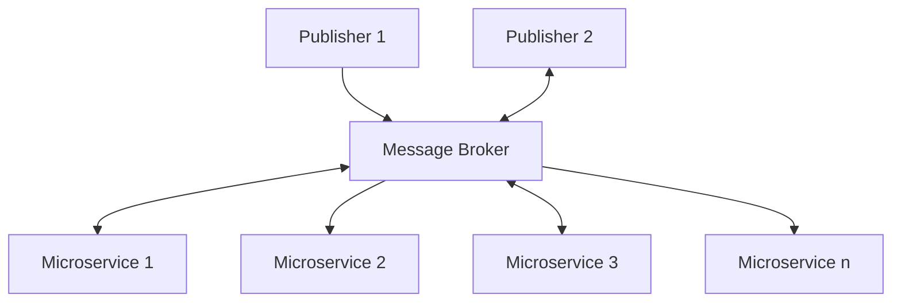
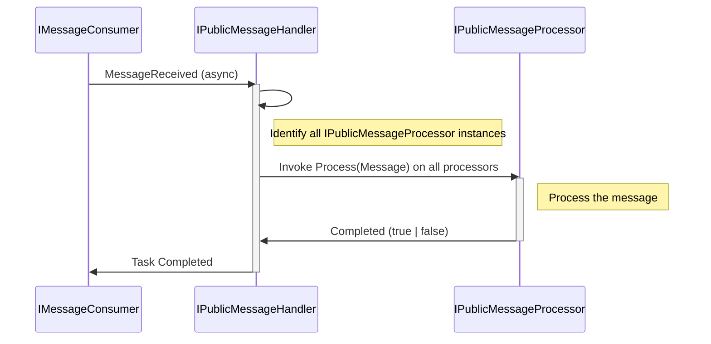
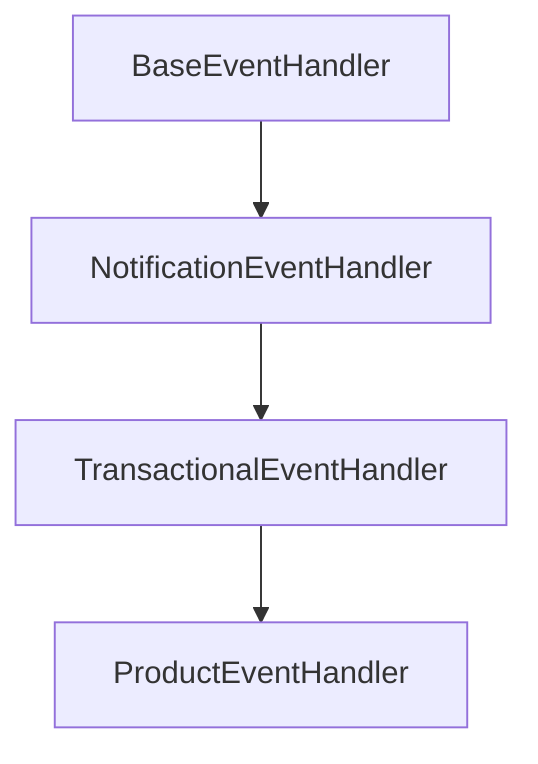

# Event Broker based solution AppKit


## Overview
In this AppKit, you will find examples on how to set up an EDA architecture where different microservices are attached to a central message broker in order to exchange messages and publish events. 


*Diagram 1*: Conceptual flowchart of the solution template

----

## Time savers
There are three major time savers in this solution: 

| Time saver | Reason | 
| ---------- | ------ |
| Configuration | Contains extension methods to let you hit the ground running in a new Microservice | 
| Common     | Contains all major reusable components in the solution, as well as helpers, extensions and the likes | 
| Brokers | Contains message broker specific implementations (i.e. `Kafka`), factories and such. Easilly replaced with your message broker of choice |
| Samples | Example implementation of 3 distinct types of Microservices that you may run across: <br /> <br /> 1. Sample.Orders - Demonstrates  a local microservice with no connections to a messagebroker whatsoever <br /> 2. Sample.Product - Demonstrates an M3-connected microservice that leverages the M3Connector for external communication <br /> 3. Sample.Warehousing - Demonstrates a one-way connected microservice that writes directly to readmodels instead of using event sourcing |    

## Getting started
### 1. Copy this project folder onto your project folder

Assuming that you have cloned your **AppKits** repo onto `C:\dev\dolittle\appkits`, in order to leverage this project for a new customer, all you have to do is to create the folder for your customers project, and then copy the contents of the `appkits\csharp\eventbrokering\source` folder onto the customer project folder, i.e. like this:


```cmd
> C:
> cd \dev\dolittle\projects\customers
> mkdir "myCustomerName"
> cd myCustomerName
> mkdir CustomerSolution
> copy C:\dev\dolittle\appkits\csharp\eventbrokering\source CustomerSolution\
```


### 2. Create your first microservice
```cmd
> cd CustomerSolution\
> dotnet new web -o Microservices\Demo.Customers
> dotnet sln add Microservices\Demo.Customers\Demo.Customers.csProj -s "00 - Microservices"
```
These three lines will create a new microservice, and add them to the solution file under the virtual solution folder named 00 - Microservices". 

> **NOTE** <br />
> Virtual Solution folders are only utilized by specialized IDE's, such as Visual Studio and Ryder. VS Code does *not* leverage virtual solution folders, but you should still strive to keep these pristine, especially when working in a team where some users are using Visual Studio or Ryder.
<br /><br />

### 3. Copy, paste and modify to your heart's content

We recommend the following procedure when you start working with your Microservice: 
* Copy the contents of the relevant `.csproj` file and replace your new project `.csproj` file with them. 
  * Make sure to replace   **&lt;UserSecretsId&gt;**. The one provided should not be used. 
  * If you're making several microservices, we recommend to use the same secret file for all that share the same solution
* Open your user secrets file, and paste the contents of [the template below](#secrets-file-template) to it
* Delete your `Program.cs`
* Copy over 3 files from the relevant Sample (see table above for relevant Microservice scenario)
  * Program.cs
  * Startup.cs
  * stitching.graphql

Once this is done, you will see that your `startup.cs` file is pointing to non-existing queries, mutations, subscriptions and eventhandler(s). Just follow the examples to create these, and you should be up and running in no time. 

> **NOTE** <br />
> The `---Subscriptions.cs` file is normally left empty, as it inherits `FrontendSubscriptions`. This ensures that it will work 
> over GraphQL Directly, or via a `GraphQL Gateway` leveraging a common `FrontendNotification` structure.


<br /><br />
----

## How public messages are handled
At the core of this implementation is a flow that runs between the message broker and "CommandProcessors". There are three actors involved: 
| Actor | Responsability |
| ------| -------------- |
| MessageConsumer | The code that consumes public messages from the event broker |
| PublicMessageHandler | The code that inspects the public message, and finds matching processors |
| PublicMessageProcessor | The code that actually does something to the Public message, i.e. `OrderDeletedProcessor` |

Here is a rought sequence diagram: 


The message processors each follow a pattern where they are set up to respond to a particular message coming over the event broker. The `IPublicMessageProcessor` interface is thus declared as follows: 

```csharp
public interface IPublicMessageProcessor
{
    /// <summary>
    /// The MessageType for which this processor was made, i.e. 'UpsertOrder'
    /// </summary>
    string ForMessageType { get; }

    ///<summary>
    /// The actual processing of the public message
    ///</summary>
    Task<bool> ProcessMessage(PublicMessage publicMessage);
}
```
> There is potential to improve on this architecture by allowing one message processor to respond to multiple message types

Each microservice can have zero, one or several PublicMessageProcessors, depending on your needs. This is why the implementation of the IPublicMessageHandler receives a dictionary of Processors in its constructor, so that each processor can execute against a recognized message. The messages are attached to the processors via the property `ForMessageType`. There must be an exact match for this processor to engage with the message. Future variants could allow for regular expressions, or for handling more than one type of message.

### Example: Product updated in M3
Assume that the product database in M3 is sending out messages such as `UpsertProduct`. In order to fully process this message, you would, using this architecture, perform the following steps: 
* Crate the class `Product`  class with the fields necessary for your application
* Create and implement the command class `UpsertProductFromM3 : Rejectable, ICommand<Product>`
* Create and implement the entity validation class `ProductValidator : IValidator<Product>` where you can validate the product entity field by field
* Create and implement the command validation class `UpsertProductBusinessValidator : IBusinessValidator<Product, UpsertProductFromM3>` for validating business rules on the incoming command

You now have the basic objects required for processing. You have declared the product class, and you have implemented validation for it, and for the command that inserts or updates that product. Now you need to process it: 

* Create and implement the class `UpsertProductFromM3Processor : PublicMessageProcessor<Product, UpsertProductFromM3>` 
* Create and implement the aggregate root for products, class `ProductAggregate`
* Create all necessary events that the aggregate will emit
  * For convenience, events can inherit the class `ValueChangeEvent` so that you can enrich your event log with single field changes
  * Don't forget to implement an `void On(Event evt)` to keep your aggregate up to date during replays
* Finally, implement one or more eventhandlers. We offer two distinctbase classes that you can enrich your eventhandler with: 
  * `NotificationEventHandler<T>` - An eventhandler that offers methods to provide notifications over `GraphQL`
  * `TransactionalEventHandler<T>` - An eventhandler that offers methods to talk back to M3

> The TransactionalEventHandler extends the NotificationEventHandler. Here is the complete inheritance diagram 



----

## Configuration

### Secret files
The solution depends on being able to read a specific format of configuration coming from the .Net "User Secret Files" concept.
Each of the bounded context microservices will this have an entry in their `.csproj` file pointing to a secret file. 
> **Important**<br  />
> Point to the same user secret file from each microservice that you define. This way, you get to keep your secrets gathered
> in one location, as they are largely the same for all projects.

Sample `.csproj` file from the Sample.Orders project: 
```xml
<Project Sdk="Microsoft.NET.Sdk.Web">
  <PropertyGroup>
	<TargetFramework>net6.0</TargetFramework>
	<Nullable>enable</Nullable>
	<ImplicitUsings>enable</ImplicitUsings>
	  <UserSecretsId>aspnet-Demo-9C343B54-7580-4ABD-BFDC-14D782C5E26A</UserSecretsId>
  </PropertyGroup>

  <ItemGroup>
	<ProjectReference Include="..\..\Brokers\Brokers.csproj" />
	<ProjectReference Include="..\..\Common\Common.csproj" />
	<ProjectReference Include="..\..\Configuration\Configuration.csproj" />
  </ItemGroup>

</Project>
```
### Secrets file template

```json
{
  "Kestrel:Certificates:Development:Password": "5211002b-92f1-4972-96a2-143ec0163d3d",
  "Kafka": {
    "GroupId": "demo-devs-devname",
    "BrokerUrl": "",
    "Username": "",
    "InputTopic": "",
    "CommandTopic": "",
    "ReceiptsTopic": "",
    "Ssl": {
      "Authority": "C:\\Users\\pedro\\OneDrive\\Documents\\Dolittle\\Projects\\DEMO\\dev_ca.pem",
      "Certificate": "C:\\Users\\pedro\\OneDrive\\Documents\\Dolittle\\Projects\\DEMO\\dev_certificate.pem",
      "Key": "C:\\Users\\pedro\\OneDrive\\Documents\\Dolittle\\Projects\\DEMO\\dev_accessKey.pem"
    }
  },
  "ApiKey": "BigBadBanana1306",
  "AzureAd": {
    "Instance": "https://login.microsoft.com/",
    "Domain": "",
    "TenantId": "",
    "ClientId": "",
    "ClientSecret": "",
    "CallbackPath": "/signin-oidc",
    "SignedOutCallbackPath": "/signout-callback-oidc"
  },
  "Microservices": {
    "redis": "localhost:7013",
    "orders": "localhost:55548"
  },
  "IGNORE_MESSAGETYPES": "BadMonkey"
}
```
*description needed for the secrets file, what is required, what is optional etc*

----


