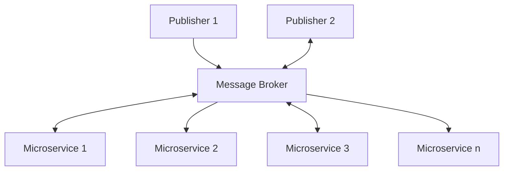
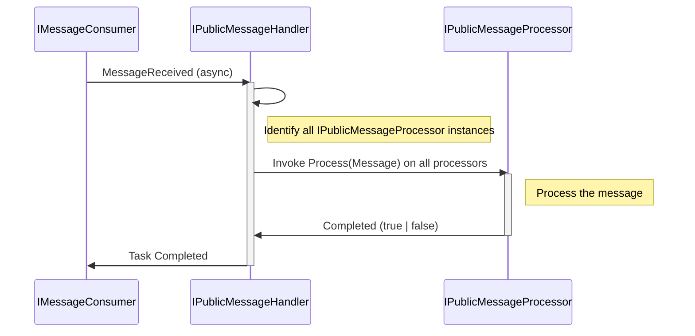

# Event Broker based solution AppKit


## Overview
In this AppKit, you will find examples on how to set up an EDA architecture where different microservices are attached to a central message broker in order to exchange messages and publish events. 


*Diagram 1*: Conceptual flowchart of the solution template

----

## Time savers
The following are the highlighted parts of the AppKit that we believe could save you some time during implementation

### IMessageBroker with Kafka implementation
The AppKit includes message broker interfaces, with implementations for Kafka that can easilly be implemented to a different message broker. The kafka broker uses a custom delegate `AsyncEventHandler` in order to ***await*** processing. There is also retry policy implemented under the hood as well as a factory for creating new consumers.


### Understanding how public messages are handled over the broker
At the core of this implementation is a flow that runs between the message broker and "CommandProcessors". There are three actors involved: 
| Actor | Responsability |
| ------| -------------- |
| MessageConsumer | The code that consumes public messages from the event broker |
| PublicMessageHandler | The code that inspects the public message, and finds matching processors |
| PublicMessageProcessor | The code that actually does something to the Public message, i.e. `OrderDeletedProcessor` |

Here is a rought sequence diagram: 


The message processors each follow a pattern where they are set up to respond to a particular message coming over the event broker. The `IPublicMessageProcessor` interface is thus declared as follows: 

```csharp
public interface IPublicMessageProcessor
{
    /// <summary>
    /// The MessageType for which this processor was made, i.e. 'UpsertOrder'
    /// </summary>
    string ForMessageType { get; }

    ///<summary>
    /// The actual processing of the public message
    ///</summary>
    Task<bool> ProcessMessage(PublicMessage publicMessage);
}
```
Each microservice can have zero, one or several PublicMessageProcessors, depending on your needs. This is why the implementation of the IPublicMessageHandler receives a dictionary of Processors in its constructor, so that each processor can execute against a recognized message. The messages are attached to the processors via the property `ForMessageType`. There must be an exact match for this processor to engage with the message. Future variants could allow for regular expressions, or for handling more than one type of message.

----

## Configuration

### Secret files
The solution depends on being able to read a specific format of configuration coming from the .Net "User Secret Files" concept.
Each of the bounded context microservices will this have an entry in their `.csproj` file pointing to a secret file. 
> **Important**<br  />
> Point to the same user secret file from each microservice that you define. This way, you get to keep your secrets gathered
> in one location, as they are largely the same for all projects.

Sample `.csproj` file from the Sample.Orders project: 
```xml
<Project Sdk="Microsoft.NET.Sdk.Web">
  <PropertyGroup>
	<TargetFramework>net6.0</TargetFramework>
	<Nullable>enable</Nullable>
	<ImplicitUsings>enable</ImplicitUsings>
	  <UserSecretsId>aspnet-Demo-9C343B54-7580-4ABD-BFDC-14D782C5E26A</UserSecretsId>
  </PropertyGroup>

  <ItemGroup>
	<ProjectReference Include="..\..\Brokers\Brokers.csproj" />
	<ProjectReference Include="..\..\Common\Common.csproj" />
	<ProjectReference Include="..\..\Configuration\Configuration.csproj" />
  </ItemGroup>

</Project>
```
### Contents required from the secrets file: 

```json
{
  "Kestrel:Certificates:Development:Password": "5211002b-92f1-4972-96a2-143ec0163d3d",
  "Kafka": {
    "GroupId": "demo-devs-devname",
    "BrokerUrl": "",
    "Username": "",
    "InputTopic": "",
    "CommandTopic": "",
    "ReceiptsTopic": "",
    "Ssl": {
      "Authority": "C:\\Users\\pedro\\OneDrive\\Documents\\Dolittle\\Projects\\DEMO\\dev_ca.pem",
      "Certificate": "C:\\Users\\pedro\\OneDrive\\Documents\\Dolittle\\Projects\\DEMO\\dev_certificate.pem",
      "Key": "C:\\Users\\pedro\\OneDrive\\Documents\\Dolittle\\Projects\\DEMO\\dev_accessKey.pem"
    }
  },
  "ApiKey": "BigBadBanana1306",
  "AzureAd": {
    "Instance": "https://login.microsoft.com/",
    "Domain": "",
    "TenantId": "",
    "ClientId": "",
    "ClientSecret": "",
    "CallbackPath": "/signin-oidc",
    "SignedOutCallbackPath": "/signout-callback-oidc"
  },
  "Microservices": {
    "redis": "localhost:7013",
    "orders": "localhost:55548"
  },
  "IGNORE_MESSAGETYPES": "BadMonkey"
}
```
*description needed for the secrets file, what is required, what is optional etc*

----


## Versions / Dependencies
This template builds on the following components and versions

| Concern              | Technology | Library      | Version | Comments | 
| -------------------- | ---------- | ------------ | ------- | -------- |
| Framework            | .Net       | -            | 6.0     | -        | 
| Language             | C#         | -            | 10.0    | -        | 
| Message Broker       | Kafka      | Confluent    | 1.8.2   | -        |
| Frontend/API         | GraphQL    | HotChocolate | 12.7    | -        |
| Inversion of Control | IoC        | Lamar        | 7.0.0   | -        | 
| Logging              | -          | Serilog      | 2.10.0  | -        |

## Installing
Ensure that your .Net version is up to the required version in the table above, or higher, then simply apply the command: 

```cmd
> dotnet restore
```

To retrieve the referenced packages in the solution. You should then be able to run the sample using

```cmd
> dotnet run 
```

### GraphQL
The entry point for the microservices leverage `GraphQL` in order to provide a two-way communication channel between the microservices and the front-end designer. 

### Kafka broker
We chose the Kafka broker for this template as it supports permanent retention time out of the box. 

----


