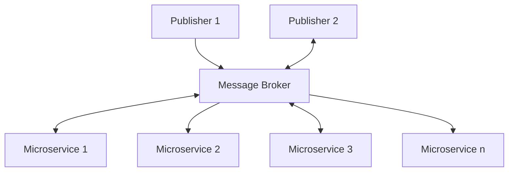
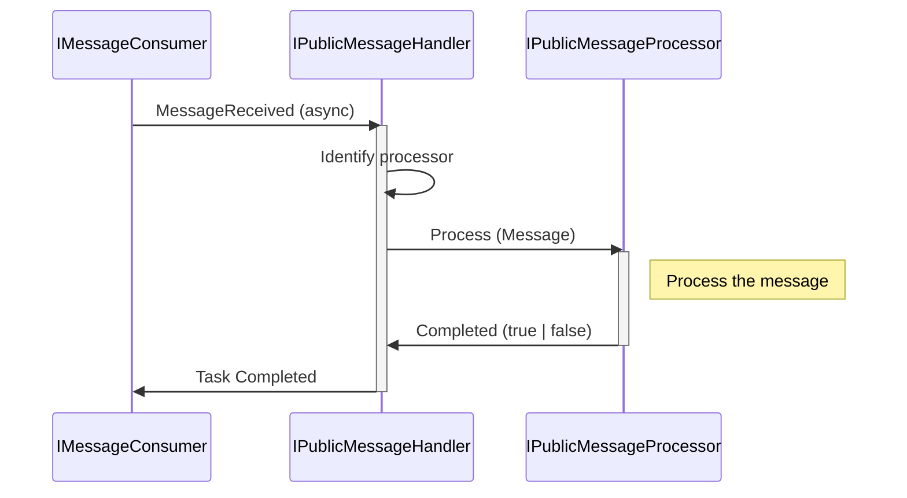

# Event Broker based solution AppKit


## Overview
In this AppKit, you will find examples on how to set up an EDA architecture where different microservices are attached to a central message broker in order to exchange messages and publish events. 


*Diagram 1*: Conceptual flowchart of the solution template

----

## Time savers
The following are the highlighted parts of the AppKit that we believe could save you some time during implementation

### IMessageBroker with Kafka implementation
The AppKit includes message broker interfaces, with implementations for Kafka, but that can easilly be implemented to a different message broker. 

### Flow sequence
At the core of this implementation is a flow that runs between the message broker and "CommandProcessors". The sequence of events is roughly:



The message processors each follow a pattern where they are set up to respond to a particular message coming over the event broker. The `IPublicMessageProcessor` interface is thus declared as follows: 

```csharp
public interface IPublicMessageProcessor
{
    /// <summary>
    /// The MessageType for which this processor was made, i.e. 'UpsertQuay'
    /// </summary>
    string ForMessageType { get; }
    Task<bool> ProcessMessage(PublicMessage publicMessage);
}
```


----

## Versions / Dependencies
This template builds on the following components and versions

| Area                 | Technology | Library      | Version | Comments | 
| -------------------- | ---------- | ------------ | ------- | -------- |
| Framework            | .Net       | -            | 6.0     | -        | 
| Language             | C#         | -            | 10.0    | -        | 
| Message Broker       | Kafka      | Confluent    | 1.8.2   | -        |
| Frontend/API         | GraphQL    | HotChocolate | 12.7    | -        |
| Inversion of Control | IoC        | Lamar        | 7.0.0   | -        | 

## Installing
Ensure that your .Net version is up to the required version in the table above, or higher, then simply apply the command: 

```cmd
> dotnet restore
```

To retrieve the referenced packages in the solution. You should then be able to run the sample using

```cmd
> dotnet run 
```

### GraphQL
The entry point for the microservices leverage `GraphQL` in order to provide a two-way communication channel between the microservices and the front-end designer. 

### Kafka broker
We chose the Kafka broker for this template as it supports permanent retention time out of the box. 

----


